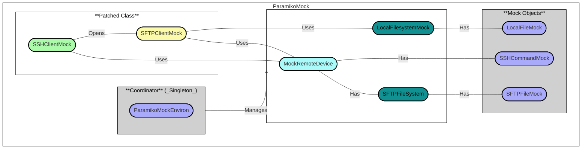

# What is ParamikoMock?

This is a mock library for the Paramiko SSH library. It is intended to be used in unit tests to mock SSH connections and commands.
It supports mocking multiple hosts and multiple commands per host as well as SFTP connections.

## How it works?

ParamikoMock is built to be used with `patch` from the `unittest.mock` module. 
We will cover how to use on the [Usage](usage.md) page.

We use the concept of a `Coordinator` class that manages the mock environment. 
The `Coordinator` is a singleton class that manages the mock environment. It is responsible for creating and managing the mock environment.



Api documentation can be found in the [API Reference](/autoapi/paramiko_mock/) page.
The full implementation can be found in the [GitHub Repository](https://github.com/ghhwer/paramiko-ssh-mock)

## Quick Start

Want to get started quickly? Here is how you can install ParamikoMock:

```bash
pip install paramiko-mock
```

## Usage Examples

ParamikoMock supports various SSH and SFTP operations for testing. Here are the main use cases:

### [Basic SSH Operations](basic-ssh.md)
Learn how to mock basic SSH commands, set up command responses, and use regular expressions for command matching.

### [Exit Status Testing](exit-status.md)
Test how your application handles different command execution outcomes with exit status mocking.

### [Connection Failures Testing](connection-failures.md)
Mock various connection failure scenarios like DNS resolution failures, timeouts, and authentication errors.

### [SFTP Operations](sftp-operations.md)
Mock file transfer operations including uploads, downloads, and remote file management.

### [Advanced Usage](advanced-usage.md)
Explore advanced patterns like custom response classes, unittest.TestCase integration, and complex testing scenarios.

For a complete overview of all available features, see the [Usage](usage.md) page.
